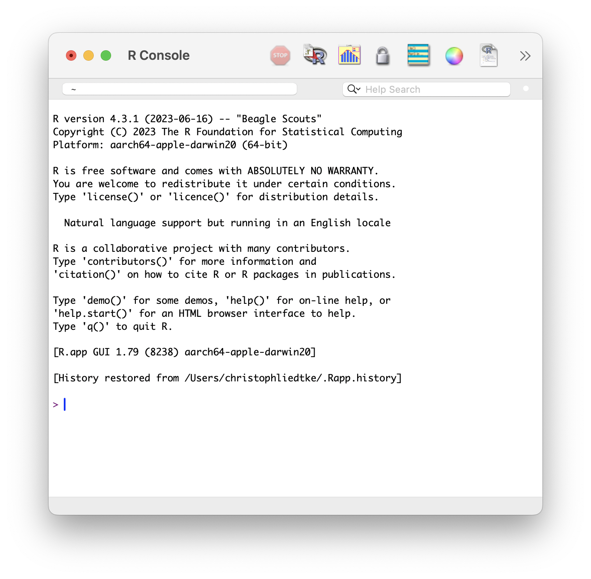

```{r setup, include=FALSE}
knitr::opts_chunk$set(echo = TRUE,
                      eval = TRUE,
                      message=FALSE,
                      error=FALSE)
knitr::opts_knit$set(root.dir = '../')
library(webexercises)
```


```{r eval=TRUE}
# set working directory
setwd("~/Documents/git_projects/RforBiologists/")

# install pacman if not already installed
if (!require("pacman")) install.packages("pacman")

# use pacman to load libraries
#pacman::p_load()

```

# Installing R

The R programming language is officially managed by the Comprehensive R Archive Network (CRAN) and can be downloaded for free [here](https://cran.r-project.org/).
  
When opening the R "console", you should see the version that is installed and a "prompt" `>`. This tells you R is ready to receive your input. It now works like a big calculator!



# Installing RStudio

Everything that you do with R, ultimately happens in the console. However, it is not the most user friendly option to do everything directly in, and only with the console.
  
Luckily, companion programs exist that amplify the R experience. These are often called _integrated development environments_ (IDEs). The most popular, and the one we will use is [RStudio](https://posit.co/download/rstudio-desktop/). Like R, the desktop version of RStudio is free and cross platform. It can be downloaded [here](https://posit.co/download/rstudio-desktop/).

RStudio has 4 windows:


# R syntax

Like any other language, R has _syntax_. This is the arrangement of words, symbols and phrases to create meaning (e.g. a sentence). Here are some of the basics:
  
## Spaces, indents and line breaks
  
* Code is run line-by-line and from left to right.
* Spaces (including indents) have no meaning!

```{r}
# this is the same:
1+1
# as this:
  1     +  1
```

## Comments

```{r}
# This is a comment!

1+1 # This is also a comment
```

## Case-sensitivity

R is case-sensitive.

```{r}
# this will work:
print("Hello")
```

```{r eval=FALSE}
# This will not:
Print("Hello")
```

## Storing information

The true power comes from storing information. To store information we use the arrow `<-` operator

```{r}
a<-1
b<-2

a+b
```

## Operators

We have already seen a few operators, such as `+` or `<-`. Most are pretty self-explanatory, but I will highlight a few more:

```{r}
# multiplication
2*3
# division
2/3
# exponents 
2^3
```

Equally important are logical operators. These are ones that will result in a `TRUE` or `FALSE`. For example:

```{r}
# smaller than
2<3
# bigger or equal to
2>=3
# same as/eual to
3==3
# not equal to
3!=2
```


# The basic building blocks

As we have already mentioned, R is an object-oriented language! That means, information is mostly stored as "objects". To master R, we therefore have to get familiar with the different types of objects. Here a few of the most important:

## Vectors

The most basic object type is a _vector_. This is a one-dimensional storage (think of it as a single line of text, or a single column in excel). We have already seen this when we stored a number as an alphabet:

```{r}
a<-1
a
```

However, we can make this more than just a single number!

```{r}
a<-1:100
```

> Tip: Rstudio will often tell you what kind of structure the data in the object has! In this case a series of 100 integers!

Vectors are not limited to numbers, then can also be characters, or "strings" as they are often called.

```{r}
b<-"Hello, World!"
```

> IMPORTANT: notice how characters are wrapped in quotations (single or double), while as numerics are not. 

If we want to store a series of data, we need to use the `c()` syntax.

```{r}
# for numerics, this:
d<-1:4
# is the same as this:
e<-c(1,2,3,4)
# but for characters, we need to use c()
f<-c("Hello, World!", "Hello, Tanzania!", "Hello, Zanzibar!", "Hello, UDSM!")
```

Two other important types of vectors that are worth mentioning are _logical_ vectors and _factors_ 

```{r}
# this is logical vector
g<-c(TRUE, FALSE)

# this is a factor (categorical variables)
h<-as.factor(c("a","b"))
```

## Matrix and Dataframe

Rarely will our data be one-dimensional. Most of the time, we will be working with tables, that is, 2D objects with rows and columns. We could combine two 1D objects into a data frame:

```{r}
df<-data.frame(e, f)
df
```

> Note: notice how we can combine different types of data (strings and numbers).

## Functions

We will come back to dataframes in more detail later, but now is a good time to introduce some more syntax, and _functions_. It is very likely that we are going to do things over and over again. Like adding together numbers.

```{r}
4+6
7+8
10+50
```

To make this more practical, we can come up with a flexible way to do this for any two numbers:

```{r}
product<-function(a,b) a+b
```

There is a lot to unpack here. We have introduced the `function()` syntax, the `arguments` of a function and the `description`.

> Note: you have already seen functions, with _data.frame()_ and _as.factor()_

we have now stored the function as and object called `product` and can now easily use it!

```{r}
product(a=2, b=9)
```

Obviously this is a fairly useless function because `+` does the same thing. In fact, R comes loaded with many useful functions, incuding `sum()`. This does exactly the same:

```{r}
sum(c(2,9))
```

> Tip: To know what arguments are available for a specific function, use the "Help" window on the bottom right.

Some other useful functions include:

```{r}
mean(c(2,9,9))
median(c(2,9,9))
length(c(2,9,9))
```

# Libraries

Sets of related functions are often stored together in a "package" or "library". Some of these come shipped with R, such as the `stats` package. One of the most powerful things about R is that _anyone_ can write a package or library and make it available to the whole community. This is why R is always evolving and is quickly becoming the leading software for statistics, data visualization,  [phylogenetics](http://www.phytools.org/), [GIS and spatial data](https://rspatial.org/), and even [web applications](https://shiny.posit.co/r/gallery/interactive-visualizations/movie-explorer/).
  
  
To make use of these libraries, we need to first install them (done only once) and then load them (needs to be done for every new session). 

```{r eval=FALSE}
# installing a package
install.packages("devtools")

# loading a package
library(devtools)
```


